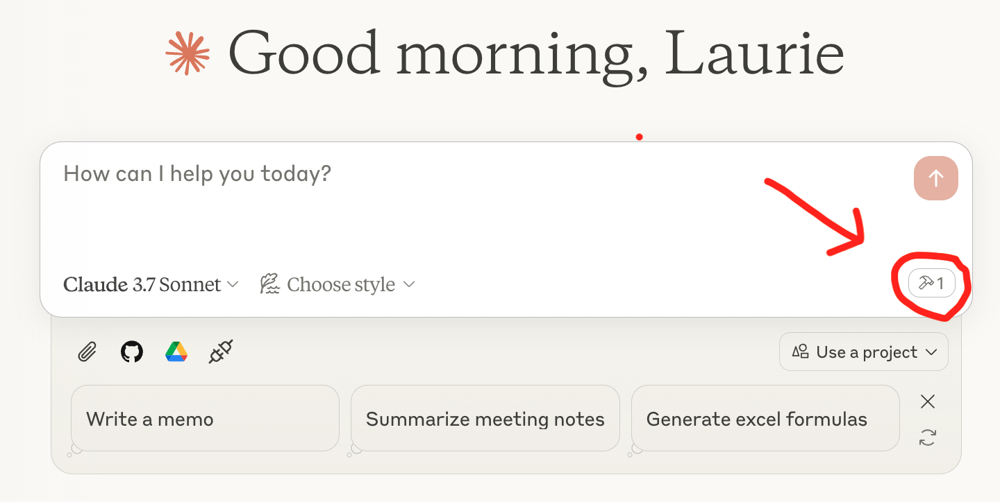

# LlamaIndex MCP demos

`llamacloud-mcp` is a tool that allows you to use LlamaCloud as an MCP server. It can be used to query LlamaCloud indexes and extract data from files.

It allows for:
- specifying one or more indexes to use for context retrieval
- specifying one or more extract agents to use for data extraction
- configuring project and organization ids
- configuring the transport to use for the MCP server (stdio, sse, streamable-http)

## Getting Started

1. Install [uv](https://docs.astral.sh/uv/getting-started/installation/)
2. Run `uvx llamacloud-mcp@latest --help` to see the available options.
3. Configure your MCP client to use the `llamacloud-mcp` server. You can either launch the server directly with `uvx llamacloud-mcp@latest` or use a `claude_desktop_config.json` file to connect with claude desktop.

### Usage

```bash
% uvx llamacloud-mcp@latest --help
Usage: llamacloud-mcp [OPTIONS]

Options:
  --index TEXT                    Index definition in the format
                                  name:description. Can be used multiple
                                  times.
  --extract-agent TEXT            Extract agent definition in the format
                                  name:description. Can be used multiple
                                  times.
  --project-id TEXT               Project ID for LlamaCloud
  --org-id TEXT                   Organization ID for LlamaCloud
  --transport [stdio|sse|streamable-http]
                                  Transport to run the MCP server on. One of
                                  "stdio", "sse", "streamable-http".
  --api-key TEXT                  API key for LlamaCloud
  --help                          Show this message and exit.
```

### Configure Claude Desktop

1. Install [Claude Desktop](https://claude.ai/download)
2. In the menu bar choose `Claude` -> `Settings` -> `Developer` -> `Edit Config`. This will show up a config file that you can edit in your preferred text editor.
3. You'll want your config to look something like this (make sure to replace `$YOURPATH` with the path to the repository):

```json
{
    "mcpServers": {
        "llama_index_docs_server": {
            "command": "uvx",
            "args": [
                "llamacloud-mcp@latest",
                "--indexes",
                "llama-index-docs:LlamaIndex documentation",
                "--extract-agents",
                "llama-index-docs-extract:LlamaIndex documentation extract agent",
                "--api-key",
                "<your-api-key>",
                "--transport",
                "stdio"
            ]
        },
        "filesystem": {
        "command": "npx",
        "args": [
                "-y",
                "@modelcontextprotocol/server-filesystem",
                "<your directory you want filesystem tool to have access to>"
            ]
        }
    }
}
```

Make sure to **restart Claude Desktop** after configuring the file.

Now you're ready to query! You should see a tool icon with your server listed underneath the query box in Claude Desktop, like this:



## LlamaCloud as an MCP server From Scratch

To provide a local MCP server that can be used by a client like Claude Desktop, you can use `mcp-server.py`. You can use this to provide a tool that will use RAG to provide Claude with up-to-the-second private information that it can use to answer questions. You can provide as many of these tools as you want.

### Set up your LlamaCloud index

1. Get a [LlamaCloud](https://cloud.llamaindex.ai/) account
2. [Create a new index](https://docs.cloud.llamaindex.ai/llamacloud/guides/ui) with any data source you want. In our case we used [Google Drive](https://docs.cloud.llamaindex.ai/llamacloud/integrations/data_sources/google_drive) and provided a subset of the LlamaIndex documentation as a source. You could also upload documents directly to the index if you just want to test it out.
3. Get an API key from the [LlamaCloud UI](https://cloud.llamaindex.ai/)

### Set up your MCP server

1. Clone this repository
2. Create a `.env` file and add two environment variables:
    - `LLAMA_CLOUD_API_KEY` - The API key you got in the previous step
    - `OPENAI_API_KEY` - An OpenAI API key. This is used to power the RAG query. You can use [any other LLM](https://docs.llamaindex.ai/en/stable/understanding/using_llms/using_llms/) if you don't want to use OpenAI.

Now let's look at the code. First you instantiate an MCP server:

```python
mcp = FastMCP('llama-index-server')
```

Then you define your tool using the `@mcp.tool()` decorator:

```python
@mcp.tool()
def llama_index_documentation(query: str) -> str:
    """Search the llama-index documentation for the given query."""

    index = LlamaCloudIndex(
        name="mcp-demo-2",
        project_name="Rando project",
        organization_id="e793a802-cb91-4e6a-bd49-61d0ba2ac5f9",
        api_key=os.getenv("LLAMA_CLOUD_API_KEY"),
    )

    response = index.as_query_engine().query(query + " Be verbose and include code examples.")

    return str(response)
```

Here our tool is called `llama_index_documentation`; it instantiates a LlamaCloud index called `mcp-demo-2` and then uses it as a query engine to answer the query, including some extra instructions in the prompt. You'll get instructions on how to set up your LlamaCloud index in the next section.

Finally, you run the server:

```python
if __name__ == "__main__":
    mcp.run(transport="stdio")
```

Note the `stdio` transport, used for communicating to Claude Desktop.

## LlamaIndex as an MCP client

LlamaIndex also has an MCP client integration, meaning you can turn any MCP server into a set of tools that can be used by an agent. You can see this in `mcp-client.py`, where we use the `BasicMCPClient` to connect to our local MCP server.

For simplicity of demo, we are using the same MCP server we just set up above. Ordinarily, you would not use MCP to connect LlamaCloud to a LlamaIndex agent, you would use [QueryEngineTool](https://docs.llamaindex.ai/en/stable/examples/agent/openai_agent_with_query_engine/) and pass it directly to the agent.

### Set up your MCP server

To provide a local MCP server that can be used by an HTTP client, we need to slightly modify `mcp-server.py` to use the `run_sse_async` method instead of `run`. You can find this in `mcp-http-server.py`.

```python
mcp = FastMCP('llama-index-server',port=8000)

asyncio.run(mcp.run_sse_async())
```

### Get your tools from the MCP server

```python
mcp_client = BasicMCPClient("http://localhost:8000/sse")
mcp_tool_spec = McpToolSpec(
    client=mcp_client,
    # Optional: Filter the tools by name
    # allowed_tools=["tool1", "tool2"],
)

tools = mcp_tool_spec.to_tool_list()
```

### Create an agent and ask a question

```python
llm = OpenAI(model="gpt-4o-mini")

agent = FunctionAgent(
    tools=tools,
    llm=llm,
    system_prompt="You are an agent that knows how to build agents in LlamaIndex.",
)

async def run_agent():
    response = await agent.run("How do I instantiate an agent in LlamaIndex?")
    print(response)

if __name__ == "__main__":
    asyncio.run(run_agent())
```

You're all set! You can now use the agent to answer questions from your LlamaCloud index.
